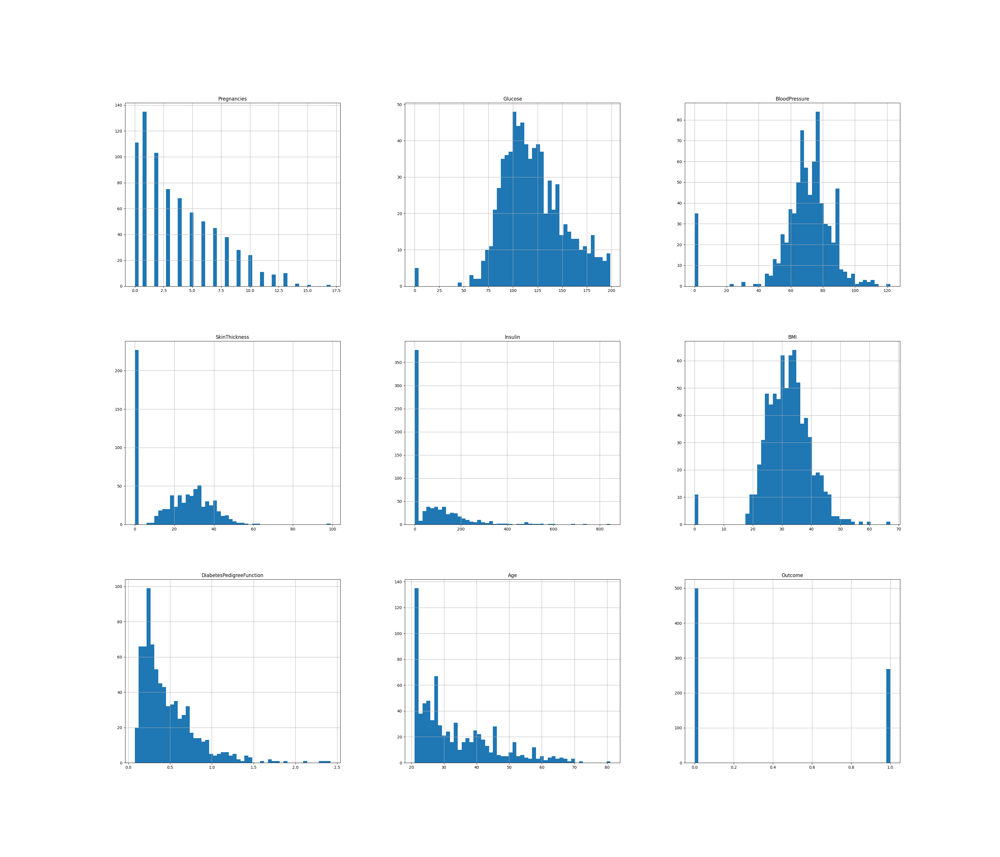
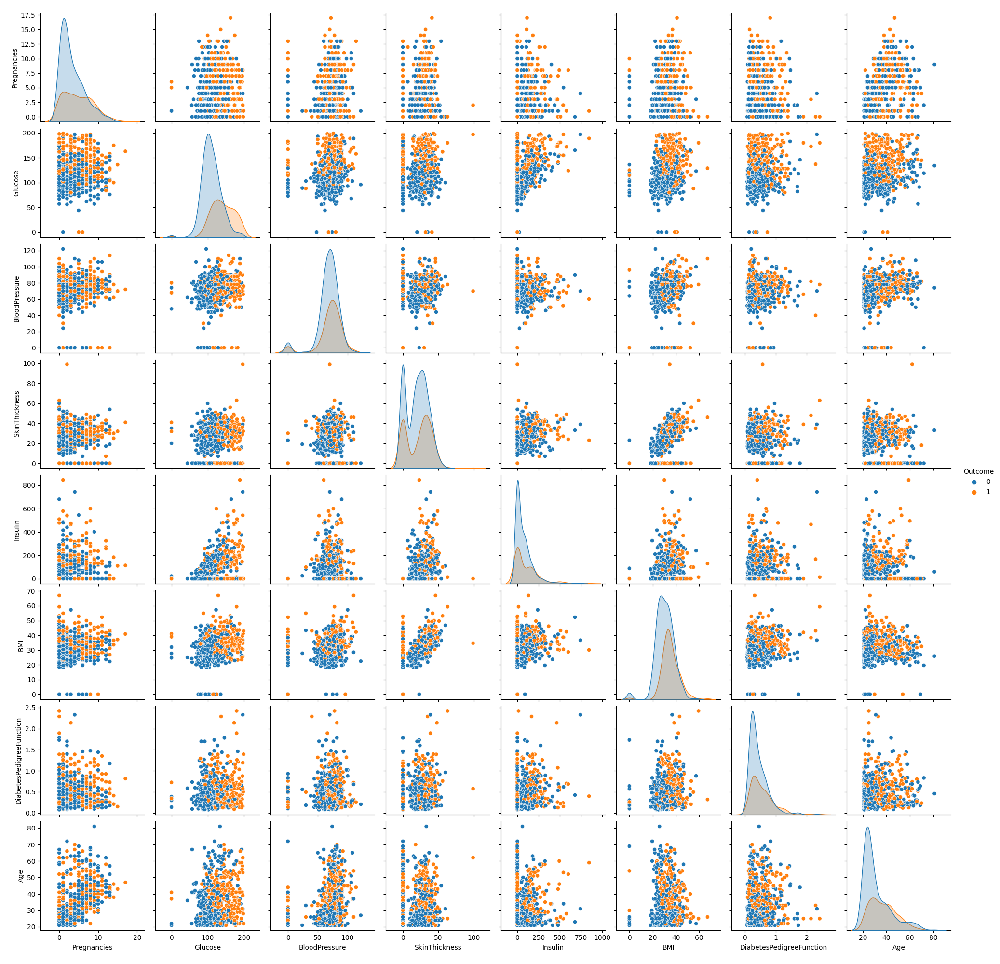
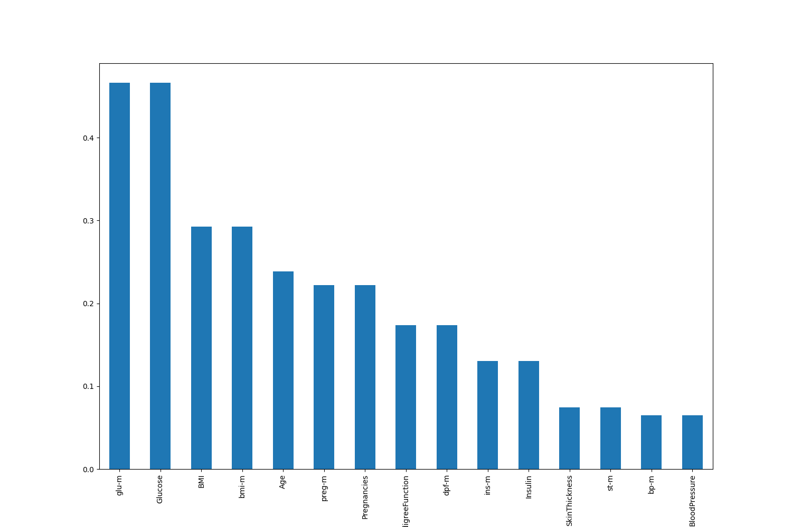

# Diabetes-Predictive-Model

---

## Introduction
Diabetes is one of most common chronic disease, that lead to many complications on the long run if not managed well. Early detection protect from have high blood glucose for long time, as the most people discover they have diabetes when their blood glucose level reached high concentration that lead to keto acidosis, which is very dangerous

---

## Brief description
* Using kaggle diabetes dataset I created predictive model
* First cleaned and explored the data 
* Created some features (feature engineering)
* Prepared the data for creating ML models then created multiple model pipelines for easier grid search for pipelines steps hyperparameters 
* Combined the best models in the hyperparameter space i searched in ensemble model
* Permutation to interpret the model ( Logistic regression ) feature importance 

---

## Data 
The datasets consist of several medical predictor (independent) variables and one target (dependent) variable.*Outcome*. 

Independent variables include:
- Pregnancies -> the number of pregnancies the patient has had
- Glucose -> Plasma glucose concentration a 2 hours in an oral glucose tolerance test
- SkinThickness -> Triceps skin fold thickness (mm)
- Insulin -> 2-hour serum insulin level (muU/ml)
- BMI -> Body mass index (weight in kg/(height in m)^2)
- DiabetesPedigreeFunction -> function which scores likelihood of diabetes based on family history
-  age
- Blood Pressure (mm Hg)

*Features distribution*

---

---

## Data Cleaning
The data were fairly clean but when I calculated the summary statistics of each variable I found that The minimum of Glucose, Blood Pressure, SkinThickness, Insulin, and BMI were zero and that physiologically impossible. So those observations that have zero in one of those variable are errors and should be eliminated and so I did

---

## Feature engineering
- I created a centered features by subtracting the mean of each feature (That sometimes enhance the machine learning algorithm performance)
- I created four new features by dividing related features the Glucose / Insulin , BMI / Skin thickness , and Calculated the HOMA IR which is an index used to assess Insulins resistance.

---

### Features correlation with the outcome

---

## Modeling

*   First I split the data to train and testing sets stratified by the outcome to insure even distribution of the outcomes in both sets
*   I tried SMOTEEN and other methods to handle data imbalance but they didn't improve the model performance so I commented them out
* then I use standerscaler to normalize the data and for each model I create pipeline and the pipeline I put polynomialfeatures so I can fine tune it's degree in the gridsearch with the model's other features 
* then for each model I print the best hyperparameter in the space I searched in and a classification report to assess the accuracy, percision and recall of model performance
* I created ( logistic regression, random forrest, SVC,LGB ) then I used ensemble model combining all the models

---

## Model interpretation

* Using the logistic regression model for inspecting the feature importance using the permutation method
* The most Predictive feature is the HOMA-IR which is index for insulin resistance I calculated form glucose and insulin
